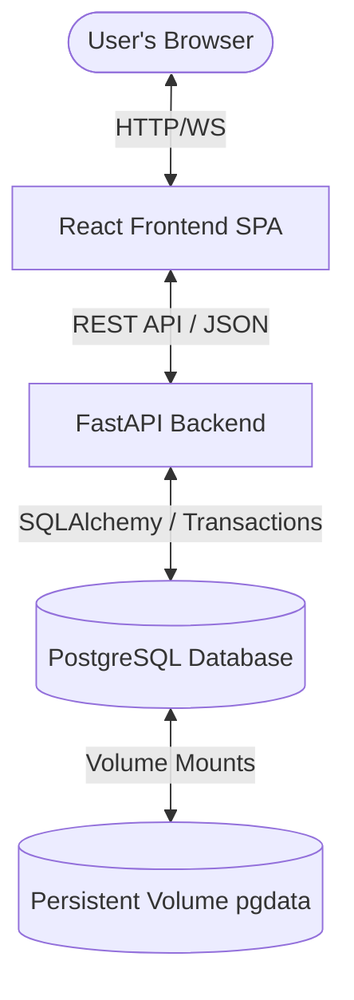

# Premium Containerized Inventory & Order Management System

A production-ready, full-stack operational dashboard and inventory/order tracker. Designed with a custom **Dark Glassmorphism (Cyberpunk-Sleek) Theme** using a React frontend, Python FastAPI backend, and PostgreSQL database.

## System Architecture Overview

The system implements a standard three-tier, containerized architecture:



- **Frontend**: React (Vite-based SPA) employing modern Dark Glassmorphic vanilla CSS. It handles all visual layouts, real-time client validation, searchable selection dropdowns, dynamic calculators, and success/error glass-toast prompts.
- **Backend**: FastAPI REST server providing typed request parsing, automated OpenAPI documentation, structured validation mapping, and transaction orchestration.
- **Database**: PostgreSQL (v15-alpine) enforcing strict database-level unique constraints and relational check constraints.

---

## Technical Features & Business Logic

1. **Transactional Integrity**: Creating an order performs atomic server-side inventory verification and stock deduction in a single database transaction. If stock for any item is insufficient, the transaction rolls back completely.
2. **Product SKU Uniqueness**: Enforced both via Pydantic model validations and PostgreSQL database-level unique indexes.
3. **Customer Email Uniqueness**: Prevents duplicate customer registrations. Email formats are validated using modern regex patterns.
4. **Order Stock Restoration**: Canceling or deleting an order restores its item quantities directly back to the products' inventory atomically.
5. **No Client-Trusted Totals**: All order line totals and total order amounts are computed dynamically by the backend service based on current prices from the database.

---

## Directory Layout

```
inventory-order-management/
├── README.md
├── .gitignore
├── docker-compose.yml
├── .env.example
├── .env
├── backend/                  # FastAPI Application
│   ├── Dockerfile
│   ├── .dockerignore
│   ├── requirements.txt
│   ├── app/
│   │   ├── main.py           # Application Entry Point
│   │   ├── config.py         # Configs Loading
│   │   ├── db.py             # SQLAlchemy Session Init
│   │   ├── models.py         # Relational DB Models
│   │   ├── schemas.py        # Pydantic Schemas
│   │   ├── routers/          # Modularized Endpoint Handlers
│   │   └── services/         # Encapsulated Business Workflows
│   └── tests/                # Automated pytest Suite
└── frontend/                 # React UI
    ├── Dockerfile
    ├── .dockerignore
    ├── package.json
    ├── vite.config.js
    ├── index.html
    └── src/                  # Components, Utilities, State
```

---

## Getting Started

### Prerequisites
- [Docker](https://www.docker.com/) and [Docker Compose](https://docs.docker.com/compose/) installed.

### Option A: Local Container Orchestration (Recommended)

1. Clone the repository and navigate to the project directory.
2. Build and launch the container ecosystem:
   ```bash
   docker-compose up --build
   ```
3. Once running, access the web portals:
   - **Frontend App**: [http://localhost:3000](http://localhost:3000)
   - **FastAPI Backend (Swagger API Docs)**: [http://localhost:8000/docs](http://localhost:8000/docs)
   - **API Health Check**: [http://localhost:8000/health](http://localhost:8000/health)

### Option B: Local Development (Manual Setup)

If you prefer to run services individually for inspection:

#### 1. Database Setup
Start a Postgres container or point to your existing server, adjusting `.env` configurations accordingly.

#### 2. Backend API Setup
```bash
cd backend
python -m venv .venv
source .venv/bin/activate # On Windows: .venv\Scripts\activate
pip install -r requirements.txt
uvicorn app.main:app --reload --port 8000
```

#### 3. Frontend App Setup
```bash
cd frontend
npm install
npm run dev -- --port 3000
```
Open [http://localhost:3000](http://localhost:3000) to view the development client.
